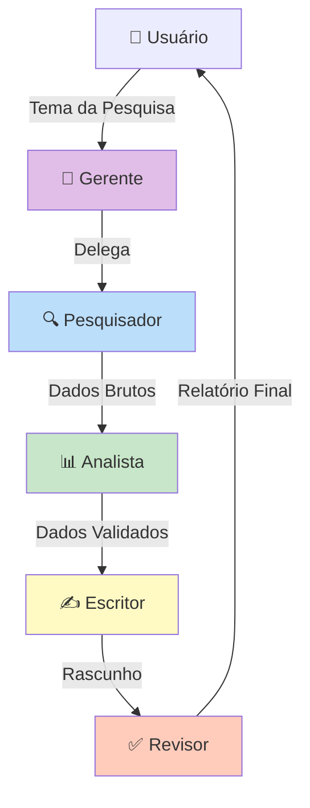

<div align="center">

# 🤖 Multi-Agents-IA


<br><br>

**Sistema Multi-Agentes de IA para Pesquisa e Análise Automatizada**

*Desenvolvido com [AntiGravity](https://antigravity.dev) - A IDE Agentic de próxima geração* 🚀

[Início Rápido](#-início-rápido) •
[Funcionalidades](#-funcionalidades) •
[Arquitetura](#-arquitetura) •
[Instalação](#-instalação) •
[Uso](#-uso) •
[Contribuir](#-contribuir)

</div>

---

## 📖 Sobre o Projeto

O **Multi-Agents-IA** é um sistema de agentes de inteligência artificial que trabalham em conjunto para realizar pesquisas profundas, análises detalhadas e produzir relatórios de alta qualidade. Construído sobre o framework [CrewAI](https://crewai.com), o projeto demonstra o poder da colaboração entre múltiplos agentes especializados.

### ✨ Destaques

- 🧠 **5 Agentes Especializados** trabalhando em sinergia
- 🔍 **Pesquisa Web Automatizada** com validação de fontes
- 📊 **Análise de Qualidade** com scoring integrado
- 📝 **Geração de Relatórios** em formato Markdown
- ⚡ **Integração com Google Gemini** (2.5 Flash, 2.5 Pro, 3 Pro Preview)

---

## 🚀 Funcionalidades

| Funcionalidade | Descrição |
|----------------|-----------|
| 🔎 **Pesquisa Profunda** | Busca automatizada na web com validação de credibilidade |
| 📈 **Análise de Dados** | Processamento e análise dos dados coletados |
| ✍️ **Redação Inteligente** | Transformação de dados em conteúdo compreensível |
| ✅ **Revisão de Qualidade** | Verificação de alucinações e consistência |
| 🎯 **Delegação Automática** | Gerente distribui tarefas conforme expertise |

---

## 🏗️ Arquitetura



### 🤖 Agentes

| Agente | Função | LLM |
|--------|--------|-----|
| **🎩 Gerente** | Coordena a equipe e delega tarefas | Gemini 3 Pro Preview |
| **🔍 Pesquisador** | Realiza pesquisas profundas na web | Gemini 2.5 Flash |
| **📊 Analista** | Analisa e valida qualidade dos dados | Gemini 2.5 Pro |
| **✍️ Escritor** | Transforma análises em relatórios | Gemini 2.5 Flash |
| **✅ Revisor** | Garante qualidade final do conteúdo | Gemini 2.5 Pro |

---

## 📦 Instalação

### Pré-requisitos

- Python 3.10 ou superior
- Conta no [Google AI Studio](https://aistudio.google.com/) (para API Key do Gemini)
- Conta no [Serper.dev](https://serper.dev/) (para busca web)

### Passo a Passo

```bash
# 1. Clone o repositório
git clone https://github.com/seu-usuario/Multi-Agents-IA.git
cd Multi-Agents-IA

# 2. Crie o ambiente virtual
python -m venv .venv

# 3. Ative o ambiente virtual
# Windows:
.venv\Scripts\activate
# Linux/Mac:
source .venv/bin/activate

# 4. Instale as dependências
pip install -r requirements.txt

# 5. Configure as variáveis de ambiente
cp .env.example .env
```

### ⚙️ Configuração

Edite o arquivo `.env` com suas chaves de API:

```env
GOOGLE_API_KEY=sua_chave_google_aqui
SERPER_API_KEY=sua_chave_serper_aqui
```

---

## 🎮 Uso

### Execução Básica

```bash
python main.py
```

O sistema solicitará o tema da pesquisa:

```
📝 Digite o tema da pesquisa: Inteligência Artificial em 2025
```

### Saída

Os relatórios são gerados automaticamente na pasta `output/`:

```
output/
├── escritor_task.md    # Relatório do Escritor
└── revisor_task.md     # Relatório Final Revisado
```

### Exemplo de Uso

```python
from crew import MultiAgentsIA

# Inicializa a crew
crew_instance = MultiAgentsIA().crew()

# Executa a pesquisa
result = crew_instance.kickoff(inputs={"topic": "Tendências de IA em 2025"})

print(result)
```

---

## 📁 Estrutura do Projeto

```
Multi-Agents-IA/
├── 📄 crew.py              # Definição dos agentes e tarefas
├── 📄 main.py              # Ponto de entrada da aplicação
├── 📁 config/
│   ├── 📄 agents.yaml      # Configuração dos agentes
│   └── 📄 tasks.yaml       # Configuração das tarefas
├── 📁 output/              # Relatórios gerados
├── 📁 .github/
│   ├── 📁 workflows/       # CI/CD pipelines
│   └── 📁 ISSUE_TEMPLATE/  # Templates de issues
├── 📄 .env.example         # Template de variáveis de ambiente
├── 📄 requirements.txt     # Dependências do projeto
├── 📄 pyproject.toml       # Configuração do projeto
├── 📄 LICENSE              # Licença MIT
├── 📄 CONTRIBUTING.md      # Guia de contribuição
└── 📄 CHANGELOG.md         # Histórico de mudanças
```

---

## 🛠️ Desenvolvimento

### IDE Recomendada

Este projeto foi desenvolvido utilizando **[AntiGravity](https://antigravity.dev)**, uma IDE agentic de próxima geração que potencializa o desenvolvimento com IA. A AntiGravity oferece:

- 🤖 **Assistência de código com IA** integrada
- ⚡ **Autocompletion inteligente** 
- 🔍 **Análise de código em tempo real**
- 🚀 **Integração perfeita** com projetos de IA

### Ferramentas de Qualidade

```bash
# Formatação de código
black .
isort .

# Linting
flake8 .

# Type checking
mypy .

# Testes
pytest --cov=. --cov-report=html
```

---

## 🤝 Contribuir

Contribuições são muito bem-vindas! Veja o arquivo [CONTRIBUTING.md](CONTRIBUTING.md) para detalhes sobre:

- Como reportar bugs
- Como sugerir melhorias
- Como enviar Pull Requests
- Guia de estilo de código

---

## 📄 Licença

Este projeto está licenciado sob a Licença MIT - veja o arquivo [LICENSE](LICENSE) para detalhes.

---

## 🙏 Agradecimentos

- [CrewAI](https://crewai.com) - Framework de agentes de IA
- [Google Gemini](https://ai.google.dev/) - Modelos de linguagem
- [Serper.dev](https://serper.dev/) - API de busca
- [AntiGravity](https://antigravity.dev) - IDE utilizada no desenvolvimento 🚀

---

<div align="center">

**Desenvolvido com ❤️ e ☕**

*Powered by [AntiGravity](https://antigravity.dev) IDE* 🚀

<br>


</div>
